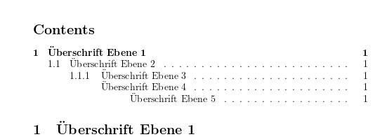

# Einführung in LaTeX

---
## Agenda

1. [Warum LaTeX](#Warum-LaTeX)
2. [LaTeX-Editor](#LaTeX-Editor)
3. [Die Sprache LaTeX](#Sprache-LaTeX)
    1. [Minimales LaTeX-Dokument](#Minimales-LaTeX-Dokument)
    2. [Dokumentklassen](#Dokumentklassen)
    3. [Befehle und Umgebungen](#Befehle)
    4. [Formatierung und Absätze](#Formatierung)
    5. [Umlaute und Sonderzeichen](#UmlauteSonderzeichen)
    6. [Packages](#Packages)
        1. [Standardpakete](#Standardpakete)

--
3. [Die Sprache LaTeX](#Sprache-LaTeX)
    7. [Beispiel-Dokumentkopf](#BeispielDokumentkopf)
    8. [Dokument formatieren und strukturieren](#DokumentFormatieren)
        1. [Zeilenabstand setzen](#Zeilenabstand)
        2. [Schriftart wählen](#Schriftart)
        3. [Horizontale Ausrichtung](#Ausrichtung)
    9. [Listen und Aufzählungen](#ListenAufzaehlungen)
        1. [Listen](#Listen)
        2. [Aufzählungen](#Aufzaehlungen)
    10. [Überschriften und Inhaltsverzeichnis](#UeberschriftenInhaltsverzeichnis)

--
3. [Die Sprache LaTeX](#Sprache-LaTeX)
    11. [Kopf- und Fußzeilen](#KopfFusszeilen)
    12. [Deckblatt](#Deckblatt)
    13. [Mathematische Symbole und Formeln](#MathSymboleUndFormeln)
        1. [Math mode](#MathMode)
        2. [Displaymath Umgebung](#Displaymath)
        3. [Symbole, Brüche und Funktionen](#SymboleBruecheFunktionen)
    14. [Tabellen und die Tabular-Umgebung](#TabellenTabularUmgebung)
        1. [Tabular-Umgebung](#TabularUmgebung)
        2. [Table-Umgebung](#TableUmgebung)

--
3. [Die Sprache LaTeX](#Sprache-LaTeX)
    15. [Bilder / Zeichnungen](#BilderZeichnungen)
        1. [Grafiken](#Grafiken)
        2. [Figure-Umgebung](#FigureUmgebung)
4. [Web-Links](#WebLinks)

---
## Warum LaTeX <!-- .element: id="Warum-LaTeX" -->
- Bearbeiten sehr umfangreicher Dokumente auf schwachen Rechnern
- Eingabe von Quellcode statt umfangreicher Menüs und Untermenüs und Formeleditoren

---
## LaTeX-Editor <!-- .element: id="LaTeX-Editor" -->
1. Texteditor + Installation einer LaTeX-Distribution  
z.B. TexLive - [https://tug.org/texlive/](https://tug.org/texlive/)
2. oder online im Browser:  
Overleaf - [https://de.overleaf.com/](https://de.overleaf.com/)

---
## Die Sprache LaTeX <!-- .element id="#Sprache-LaTeX" -->

---
### Minimales LaTeX-Dokument <!-- .element: id="Minimales-LaTeX-Dokument" -->

```latex[1-2|4-6]
% setzen der Dokumentklasse
\documentclass{article}

% umschliesst den Inhalt des Dokuments
\begin{document}
\end{document}
```

---
### Dokumentklassen <!-- .element: id="Dokumentklassen" -->
- **article**
    - für wissenschaftliche Artikel
    - typischer Weise wenige Seiten
    - mehrstufige Überschriften (5 Ebenen)
    - Standardmäßig wird der Titel nicht auf einer eigenen Seite gedruckt
- **letter**
    - für Briefe

--
### Dokumentklassen
- **report**
    - für Seminar/Abschlussarbeiten
    - Seitenzahl typischer Weise unter 100 Seiten
    - Titel wird standardmäßig auf einer eigenen Seite gedruck
- **book**
     - zusätzliche Überschriftenebene für Kapitel
     - typischer Weise >200 Seiten
     - mit Vorwort, Kapiteln, Anhängen, Inhaltsverzeichnis, Stichwortverzeichnis...

--
### Dokumentklassen
Der Workshop fokussiert sich auf die **article**-Class.

Weitere Dokumentklassen und deren Optionen siehe Kapitel 3 in [LaTeX2e: An unofficial reference manual](https://ftp.agdsn.de/pub/mirrors/latex/dante/info/latex2e-help-texinfo/latex2e.pdf)

---
### Befehle und Umgebungen <!-- .element: id="Befehle" -->

```latex[1|2|3|5-6|8-9]
\befehlsname
\befehlsname{erster Parameter}{zweiter Parameter}
\befehlsname[optionaler Parameter]{erster}{zweiter}

% Befehle können zusätzlich mit { } umschlossen werden
{\befehlsname}

\begin{Umgebungsname}
\end{Umgebungsname}
```

---
### Formatierung und Absätze <!-- .element: id="Formatierung" -->
- **\textbf{...}**  
    Text wird fett gedruckt
- **\textit{...}**  
    Text wird kursiv gedruckt
- <b>\\\\</b> oder **\newline**  
    erzwingt einen Zeilenumbruch

--
### Formatierung und Absätze
```latex[4-5]
\documentclass{article}

\begin{document}
Text mit \textbf{fett} oder \textit{kursiv} formatierten Wörtern.
Hinter diesem Wort \\ kommt ein erzwungener Zeilenumbruch
\end{document}
```


--
### Formatierung und Absätze
- **\newpage**  
    erzwingt einen Seitenumbruch
- **\pagebreak**  
    fügt einen Seitenumbruch HINTER dem nächsten Zeilenumbruch ein.

```latex[4]
\documentclass{article}

\begin{document}
\pagebreak Am Ende dieses Absatzes wird ein Zeilenumbruch gemacht.
\end{document}
```

---
### Umlaute und Sonderzeichen <!-- .element: id="UmlauteSonderzeichen" -->

 als Befehl
 - **\\"a** bzw. **\\"A"** für ä bzw. Ä
 - **\\"o** bzw. **\\"O"** für ö bzw. Ö
 - **\\"u** bzw. **\\"U"** für ü bzw. Ü
 - **{\\ss}** für ß

--
### Umlaute und Sonderzeichen
 ```latex[4]
 \documentclass{article}

 \begin{document}
 \"a \"A \"o \"O \"u \"u {\ss}
 \end{document}
 ```
 

--
### Umlaute und Sonderzeichen

direkt verwenden durch Einbinden des *inputenc* Packages (ab TexLive >=2018 nicht mehr notwendig)

--
### Umlaute und Sonderzeichen
```latex[3,6]
\documentclass{article}

\usepackage[utf8]{inputenc}

\begin{document}
ä ö ü Ä Ö Ü ß
\end{document}
```


---
### Packages <!-- .element: id="Packages" -->

- Packages definieren zusätzliche Befehle und Umgebungen für bestimmte Einsatzzwecke.
- Dokumentation zu einzelnen Packages: [https://ctan.org/pkg/](https://ctan.org/pkg/)
- Einbinden eines Packages per
```latex
\usepackage[Optionen]{Paketname}
```

--
### Standardpakete <!-- .element: id="Standardpakete" -->

- [**babel**](https://ctan.org/pkg/babel)
    - automatische Silbentrennung
- [**geometry**](https://ctan.org/pkg/geometry)
    - Seitenlayout (z.B. Seitenränder) setzen
- [**graphicx**](https://ctan.org/pkg/graphicx)
    - Laden und einfügen von Grafiken

--
### Standardpakete
- [**inputenc**](https://ctan.org/pkg/inputenc)
    - Setzen der Quelltext-Kodierung für korrekte Verwendung von Sonderzeichen
- [**setspace**](https://ctan.org/pkg/setspace)
    - Setzen von Zeilenabständen
<!-- - [**amsmath**](https://ctan.org/pkg/amsmath)   
    - Ausgerichtetes Setzen von mehrstufigen Berechnungen / Herleitungen / Beweisen
- [**glossaries**](https://ctan.org/pkg/glossaries)
    - Verschiedene Index-Typen für Stichwortverzeichnis, Glossar, Abkürzungsverzeichnis, ...
- [**hyperref**](https://ctan.org/pkg/hyperref)
    - Klickbare Referenzen innerhalb des PDF Dokuments
- [**makeidx**](https://ctan.org/pkg/makeidx)
    - Erzeugung von Stichwortverzeichnissen -->

---
### Beispiel-Dokumentkopf <!-- .element: id="BeispielDokumentkopf" -->
```latex[1-7|9-11|13-15|17-18|20-22]
% Dokumentklasse article auswählen
%   Optionen:
%     11pt      - Standardschriftgröße
%     a4paper   - Papierformat
%     titlepage - Titel auf eigener Seite ausgeben
%     twoside   - Seitenlayout auf beidseitigen Druck optimieren
\documentclass[11pt,a4paper,titlepage,twoside]{article}

% "linken" Seitenrand auf 3cm setzen
% - wird durch die Option "twoside" automatisch alterniert
\usepackage[left=3 cm]{geometry}

% Zeichensatz der Eingabedatei festlegen
% erlaubt direktes Tippen von Umlauten
\usepackage[utf8]{inputenc}

% Silbentrennung für die neue deutsche Rechtschreibung laden
\usepackage[ngerman]{babel}

\begin{document}
Dies ist ein Absatz mit Text.
\end{document}
```

---
## Dokument formatieren und strukturieren <!-- .element: id="DokumentFormatieren" -->

--
### Zeilenabstand setzen <!-- .element: id="Zeilenabstand" -->
Das Package [**setspace**](https://ctan.org/pkg/setspace?lang=de) bringt eine Reihe von Befehlen mit, um den Zeilenabstand des Dokuments zu Beginn zu setzen:

- **\singlespacing**  
- **\onehalfspacing**  
- **\doublespacing**  
- **\setstretch{factor}**

```latex[]
\usepackage{setspace}
\setstretch{1.7}
```

--
### Zeilenabstand setzen
Alternativ führt das **setspace** Package Umgebungen ein, innerhalb derer ein bestimmte Zeilenabstand vorgegeben werden kann.  

- **singlespacing**  
- **onehalfspacing**  
- **doublespacing**  
- **spacing{Faktor}**

--
### Zeilenabstand setzen
```latex[2,5-7,9-11]
...  
\usepackage{setspace}  

\begin{document}
    \begin{singlespacing}
        Absatz mit einfachem Zeilenabstand.
    \end{singlespacing}

    \begin{spacing}{1.7}
        Absatz mit 1,7-fachem Zeilenabstand.
    \end{spacing}
\end{document}
```

--
### Schriftart wählen <!-- .element: id="Schriftart" -->
- PdfLaTeX unterstützt die Schriftarten des **fontenc** Packages (siehe Kapitel 4 in [latex2e](https://ftp.agdsn.de/pub/mirrors/latex/dante/info/latex2e-help-texinfo/latex2e.pdf)).
- Liste aller Schriftarten:  
    [https://tug.org/FontCatalogue/](https://tug.org/FontCatalogue/)  

z.B.
```latex[2-3]
...
\usepackage{fontspec}
\setmainfont{QTCasual}  
...
\begin{document}
    Dies ist ein Test-Absatz.
\end{document}
```

--
### Schriftart wählen
Schriftart Times
```latex[3-4]
\documentclass{article}

\usepackage[T1]{fontenc}
\usepackage{mathptmx}

\begin{document}
Dies ist ein Beispielabsatz in der Schriftart Times.
\end{document}
```


--
### Schriftart wählen
Schriftart Helvetica
```latex[3-5]
\documentclass{article}

\usepackage[T1]{fontenc}
\usepackage{helvet}
\renewcommand{\familydefault}{\sfdefault}

\begin{document}
Dies ist ein Beispielabsatz in der Schriftart Helvetica.
\end{document}
```


--
### horizontale Ausrichtung <!-- .element: id="Ausrichtung" -->
- Umgebungen für horizontale Textausrichtung
    - linksbündig
    ```latex[]
    \begin{flushleft}...\end{flushleft}
    ```
    - rechtsbündig
    ```latex[]
    \begin{flushright}...\end{flushright}
    ```
    - zentriert
    ```latex[]
    \begin{center}...\end{center}
    ```

--
### horizontale Ausrichtung
```latex[4-10]
\documentclass{article}

\begin{document}
  \begin{flushleft}
    Dieser Absatz wird linksbündig gesetzt.
  \end{flushleft}

  \begin{flushright}
    Dieser Absatz wird rechtsbündig gesetzt.
  \end{flushright}
\end{document}
```


--
### horizontale Ausrichtung
```latex[4-6]
\documentclass{article}

\begin{document}
  \begin{center}
    Dieser Absatz wird zentriert gesetzt.
  \end{center}
\end{document}
```


---
## Listen und Aufzählungen <!-- .element: id="ListenAufzaehlungen" -->

--
### Listen <!-- .element: id="Listen" -->
- Listen lassen sich mit der **itemize** Umgebung einfügen
```latex[]
\begin{itemize} ... \end{itemize}
```
- Stichpunkte starten mit
```latex[]
\item
```

--
### Listen
```latex[4-7]
\documentclass{article}

\begin{document}
  \begin{itemize}
    \item Äpfel
    \item Birnen
  \end{itemize}
\end{document}
```


--
### verschachtelte Listen

```latex[4-7,12|8-11]
\documentclass{article}

\begin{document}
  \begin{itemize}
    \item Äpfel
    \item Birnen
    \item Gemüse:
        \begin{itemize}
            \item Tomaten
            \item Gurken
        \end{itemize}
  \end{itemize}
\end{document}
```


---
### Aufzählungen <!-- .element: id="Aufzaehlungen" -->
- Für Aufzählungen gibt es die **enumerate** Umgebung
```latex[]
\begin{itemize} ... \end{itemize}
```
- Aufzählunspunkte starten mit
```latex[]
\item
```

--
### Aufzählungen
```latex[4-7]
\documentclass{article}

\begin{document}
  \begin{enumerate}
    \item Äpfel
    \item Birnen
  \end{enumerate}
\end{document}
```


--
### verschachtelte Aufzählungen
```latex[4-7,12|8-11]
\documentclass{article}

\begin{document}
  \begin{enumerate}
    \item Äpfel
    \item Birnen
    \item Gemüse:
        \begin{enumerate}
            \item Tomaten
            \item Gurken
        \end{enumerate}
  \end{enumerate}
\end{document}
```

--
### verschachtelte Aufzählungen


---
### Überschriften und Inhaltsverzeichnis <!-- .element: id="UeberschriftenInhaltsverzeichnis" -->
Die article-Class definiert 5 Standardebenen für Überschriften
- **\section**
- **\subsection**
- **\subsubsection**
- **\paragraph**
- **\subparagraph**

--
### Überschriften und Inhaltsverzeichnis
Über Variablen lässt sich steuern, wieviele Ebenen nummeriert werden sollen:
- **secnumdepth**  
    Anzahl der Ebenen, für die eine Nummerierung in den Überschriften angezeigt werden soll
- **tocdepth**
    Anzahl der Ebenen die im Inhaltsverzeichnis aufgeführt werden sollen

--
### Überschriften und Inhaltsverzeichnis
```latex[6-10]
\documentclass{article}

\setcounter{secnumdepth}{3}

\begin{document}
  \section{Überschrift Ebene 1}
  \subsection{Überschrift Ebene 2}
  \subsubsection{Überschrift Ebene 3}
  \paragraph{Überschrift Ebene 4}
  \subparagraph{Überschrift Ebene 5}
\end{document}
```

--
### Überschriften und Inhaltsverzeichnis


--
### Überschriften und Inhaltsverzeichnis
- Platzieren des Inhaltsverzeichnisses
```latex[]
\tableofcontents
```
- Hinweis: pdflatex muss zweimal ausgeführt werden

--
### Überschriften und Inhaltsverzeichnis
```latex[3,6]
\documentclass{article}

\setcounter{tocdepth}{5}

\begin{document}
  \tableofcontents

  \section{Überschrift Ebene 1}
  \subsection{Überschrift Ebene 2}
  \subsubsection{Überschrift Ebene 3}
  \paragraph{Überschrift Ebene 4}
  \subparagraph{Überschrift Ebene 5}
\end{document}
```

--
### Überschriften und Inhaltsverzeichnis


--
### Überschriften und Inhaltsverzeichnis
- Lange Dokumente sollten aufgeteilt werden
    - z.B. eine Datei pro **\section**.
- Eine externe Datei *Beispielabschnitt.tex* kann mit dem Befehl
    ```
    \input[Beispielabschnitt]
    ```
    eingebunden werden.

--
### Überschriften und Inhaltsverzeichnis
Beispiel
```latex[1-5|7-8|10,13,15,17,19|11-12,14,16,18,20]
% Automatische Nummerierung für Überschriften bis Ebene 3
\setcounter{secnumdepth}{3}

% Automatische Nummerierung für Überschriften im Inhaltsverzeichnis bis Ebene 3
\setcounter{tocdepth}{3}

% Inhaltsverzeichnis platzieren
\tableofcontents

\section{Überschrift Ebene 1}
% Quelltext aus externer Datei Beispielabschnitt.tex einbinden
\input{Beispielabschnitt}
\subsection{Überschrift Ebene 2}
\input{Beispielabschnitt}
\subsubsection{Überschrift Ebene 3}
\input{Beispielabschnitt}
\paragraph{Überschrift Ebene 4}
\input{Beispielabschnitt}
\subparagraph{Überschrift Ebene 5}
\input{Beispielabschnitt}
```

---
## Kopf- und Fußzeilen <!-- .element: id="KopfFusszeilen" -->
Die **pagestyle** der article-Klasse kennt 4 Modi für Kopf- und Fußzeilen
- Keine Kopfzeile  
  Seitenzahlen zentriert in der Fußzeile
  ```latex[]
  \pagestyle{plain}
  ```
- Leere Kopf-/Fußzeile
  ```latex[]
  \pagestyle{empty}
  ```

--
## Kopf- und Fußzeilen
- Kopfzeile  
    - ungerade Seiten: Überschrift der aktuellen **section**
    - gerade Seiten: Überschrift der aktuellen **subsection**
    - Seitenzahlen aussen
    ```latex[]
    \pagestyle{headings}
    ```
- manuelle Kopfzeilen
  ```latex[]
  \pagestyle{myheadings}
  ```
  - Kopfzeilentitel linker und rechter Seiten setzen (twoside):
  ```latex[]
  \markboth{Titel linke Seiten}{Titel rechte Seiten}
  ```
  - Kopfzeilentitel gerader Seiten setzen:
  ```latex[]
  \markright{Titel rechte Seiten}
  ```

---
## Deckblatt <!-- .element: id="Deckblatt" -->
- kann mit der Umgebung **titlepage** eingefügt werden
- blendet seine Seitennummer aus
- keine Kopf- oder Fußzeilen

```latex[2-10]
...
\begin{titlepage}
  % Informationen für Titel setzen
  \title{Meine Arbeit}
  \author{Ich}
  \date{Heute}

  % Titel generieren
  \maketitle
\end{titlepage}
```

--
## Deckblatt zweiseitiger Druck
- erste Seite nach dem Deckblatt mit Seitennummer 1 versehen

```latex[12-16]
...
\begin{titlepage}
  ...
\end{titlepage}

% Leerseite einfügen (Rückseite der Titelseite)
\null \thispagestyle{empty} \newpage

% Seitenzahl auf 1 zurücksetzen
\setcounter{page}{1}
```

---
## Mathematische Symbole und Formeln <!-- .element: id="MathSymboleUndFormeln" -->
- Siehe Kapitel 16 [latex2e](https://ftp.agdsn.de/pub/mirrors/latex/dante/info/latex2e-help-texinfo/latex2e.pdf)  
- Befehle für Formeln und Symbole funktionieren entweder im **Math mode** oder in einer **displaymath**-Umgebung

--
### Math mode <!-- .element: id="MathMode" -->
- mathematische Ausdrücke im Fliesstext
-
```latex[]
$ ... $
```
-
```latex[]
\( ... \)
```
-
```latex[]
\begin{math} ... \end{math}
```

--
### Math mode
```latex[5|7|9]
...

\begin{document}
  Die Funktionen
  $ \sin x$
  und
  \( \cos \)
  sowie
  \begin{math} \tan x \end{math}
  sind Winkelfunktionen.
\end{document}
```


--
### Displaymath Umgebung <!-- .element: id="Displaymath" -->
- mathematische Formeln zentriert ausserhalb des Textes
```latex[]
\begin{displaymath} ... \end{displaymath}
```

--
### Displaymath Umgebung
```latex[6-12]
...

\begin{document}
  Ein Beispiel für ein bestimmtes Integral eines Polynoms ist dieses.

  \begin{displaymath}
    \int_{i=0}^k
      x^2 + x =
      \bigl[
        \frac{1}{3} x^3 + \frac{1}{2} x^2
      \bigr]_0^k
  \end{displaymath}
\end{document}
```


--
### Symbole, Brüche, Funktionen <!-- .element: id="SymboleBruecheFunktionen" -->
- Pi
  ```latex[]
    \pi
  ```
- Bruch
  ```latex[]
  \frac{Zaehler}{Nenner}
  ```
- Wurzel
  ```latex[]
  \sqrt{x}
  ```
- n-te Wurzel, z.B. Kubikwurzel
  ```latex[]
  \sqrt[3]{x}
  ```

--
### Symbole, Brüche, Funktionen
```latex[5-8]
\documentclass{article}

\begin{document}
  \begin{itemize}
    \item Pi $\pi$
    \item Bruch $\frac{Zaehler}{Nenner}$
    \item Wurzel $\sqrt{x}$
    \item Kubikwurzel $\sqrt[3]{x}$
  \end{itemize}
\end{document}
```


--
### Symbole, Brüche, Funktionen
- Subscript
```latex[]
  a_k
  a_{i+1}
```
- Exponent/Superscript
```latex[]
  x^k
  x^{i+1}
```
- Integrale **\\int_{n=0}^{k} x**
```latex[]
  \int_{n=0}^{k} x
```

--
### Symbole, Brüche, Funktionen
```latex[5-9]
\documentclass{article}

\begin{document}
    \begin{itemize}
      \item $a_k$
      \item $a_{i+1}$
      \item $x^k$
      \item $x^{i+1}$
      \item $\int_{n=0}^{k} x$
    \end{itemize}
\end{document}
```


--
### Symbole, Brüche, Funktionen
- Klammern ( ... )
```latex[]
\left( ... \right)
```
- Klammern [ ... ]
```latex[]
\left[ ... \right]
```
- Klammern { ... }
```latex[]
\left\{ ... \right\}
```
- Klammern &lt; ... &gt;
```latex[]
\langle ... \rangle
```

--
### Symbole, Brüche, Funktionen
```latex[5-8]
\documentclass{article}

\begin{document}
  \begin{itemize}
    \item $\left( ... \right)$
    \item $\left\{ ... \right\}$
    \item $\left[ ... \right]$
    \item $\langle ... \rangle$
  \end{itemize}
\end{document}
```


--
### Symbole, Brüche, Funktionen
```latex[5,7-9]
\documentclass{article}

\begin{document}
  Im math-Mode sehen Integrale (
  $ \int_{n=0}^{k} x $
  ) anders aus, als in der displaymath-Umgebung:
  \begin{displaymath}
    \int_{n=0}^{k} x
  \end{displaymath}
\end{document}
```


---
## Tabellen und die tabular-Umgebung <!-- .element id="TabellenTabularUmgebung" -->

-
## tabular-Umgebung <!-- .element id="TabularUmgebung" -->
- richtet Text Tabellen-artig aus
```latex[2-4]
...
\begin{tabular}{Spaltendefinition}
  ...
\end{tabular}
```
- erster Parameter bestimmt für die Spalten
    - die Textausrichtung
    - sowie die Platzierung vertikaler Ränder

--
### tabular-Umgebung
- Verwendung folgender Zeichen für den Parameter *Spaltendefinition*
    - c zentriert
    - l linksbündig
    - r rechtsbündig
    - | vertikalen Rand einfügen
```latex[2-4]
...
\begin{tabular}{|cc|}
  ...
\end{tabular}
```

--
### tabular-Umgebung
- innerhalb der tabular-Umgebung werden
  - Zeilen mit <b>\\\\</b> abgeschlossen
  - Zell-Inhalte mit **&** getrennt
  - horizontale Linien mit **\\hline** platziert

--
### tabular-Umgebung
```latex[2-9]
...
% Tabelle mit vertikalen Rändern | aussen
% ... und horizontalen Rändern ganz oben und ganz unten
\begin{tabular}{|ll|}
    \hline
    Äpfel & 37,33 \\
    Birnen & 16,00 \\
    \hline
\end{tabular}
```


--
#### Spalten verbinden
- ist mit dem Befehl **\multicolumn** möglich
- Syntax für den Parameter *Spaltendefinition* ist identisch zu dem der tabular-Umgebung

```latex[]
\multicolumn{Anzahl}{Spaltendefinition}{Zelleninhalt}
```

--
#### Spalten verbinden
```latex[4]
...
\begin{tabular}{|l|l|}
    \hline
    \multicolumn{2}{|l|}{Äpfel kosten 37,33} \\
    \hline
    Birnen & 16,00 \\
    \hline
\end{tabular}
```


--
#### Titelzeilen
Textausrichtung einzelner Zellen überschreiben

```latex[1,3-8]
\begin{tabular}{|ll|}
    \hline
    \multicolumn{1}{|c}{
      \textbf{Typ}
    }
    & \multicolumn{1}{c|}{
      \textbf{Preis}
    } \\
    \hline
    Äpfel & 37,33 \\
    Birnen & 16,00 \\
    Mandarinen & 10,00 \\
    \hline
\end{tabular}
```


--
### Table-Umgebung <!-- .element id="TableUmgebung" -->
- ist ein **Gleitobjekt** und wird durch LaTeX automatisch positioniert
- wird um eine Tabular-Umgebung herum im Code platziert
- wird automatisch durchnummeriert
- hat einen Titel


```latex[2-7]
...
\begin{table}
    \caption{Tabellentitel}
    \begin{tabular}{...}
      ...
    \end{tabular}
\end{table}
```

--
### Table-Umgebung
```latex[2-3,11]
\begin{document}
  \begin{table}
    \caption{Tabellentitel}

    \begin{tabular}{|llr|}
        \hline
        Äpfel & 37,33 & Obstsorte. Darf nicht mit Birnen verglichen werden.\\
        Birnen & 16,00 & Weitere Obstsorte\\
        \hline
    \end{tabular}
  \end{table}
\end{document}
```


---
## Bilder / Zeichnungen <!-- .element id="BilderZeichnungen" -->
### Grafiken <!-- .element id="Grafiken" -->
- Können mit dem Paket **graphicx**
- ... und dem folgenden Befehl eingefügt werden
```latex[]
\includegraphics
```

```latex[1,5]
\usepackage{graphicx}
...
\begin{document}
  ...
  \includegraphics[width=Breite]{Pfad zur Bilddatei}
  ...
\end{document}
```

--
### Figure-Umgebung <!-- .element id="FigureUmgebung" -->
- figures sind **Gleitobjekte** und werden durch LaTeX automatisch positioniert
  ```latex
  \begin{figure} ... \end{figure}
  ```
- werden um Grafiken herum im Code platziert
- werden automatisch durchnummeriert
- haben einen Titel

--
### Figure-Umgebung
```latex[1,5-8]
\usepackage{graphicx}
...
\begin{document}
  ...
  \begin{figure}
    \caption{Titel der Grafik}
    \includegraphics[width=10cm]{sample.jpg}
  \end{figure}
...
\end{document}
```

---
# Web-Links <!-- .element id="WebLinks" -->
## LaTeX-Umgebungen
- (Overleaf Online-Editor)[https://de.overleaf.com/]
- (Liste von LaTeX-Distributionen)[https://tug.org/interest.html#free]
## Dokumentation
- [LaTeX-Sheet Uni-Frankfurt](https://www.uni-frankfurt.de/53485609/latexsheet.pdf) - 2 A4 Seiten Kurzreferenz
- [LaTeX2e](https://ftp.agdsn.de/pub/mirrors/latex/dante/info/latex2e-help-texinfo/latex2e.pdf) - ausführliche Referenz durch viele Themengeiete
- [LaTeX-Wiki TU-Graz](https://latex.tugraz.at/)
- [CTAN](https://www.ctan.org/) - Liste + Doku aller Packages

---
# Fragen
